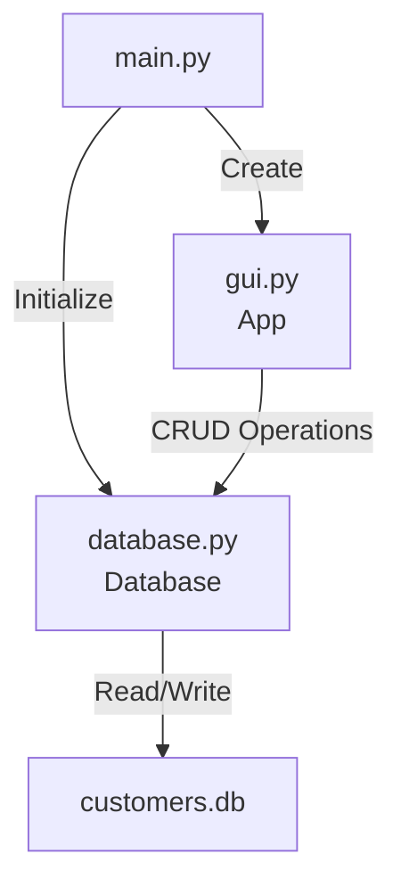
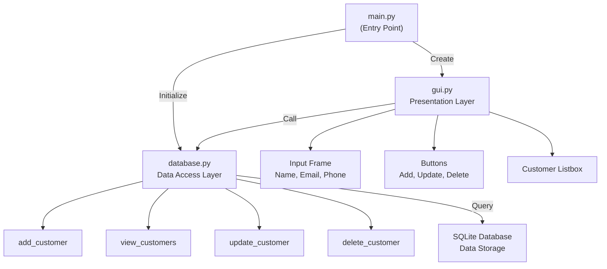
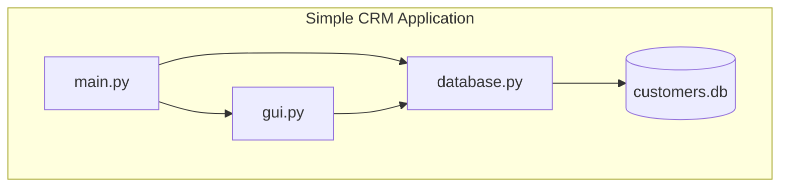

## Component Diagrams

## Diagram 1: Simple Layered Architecture

```mermaid
graph TB
    Main["main.py"]
    GUI["gui.py<br/>App"]
    DB["database.py<br/>Database"]
    SQLite["customers.db"]
    
    Main -->|Initialize| DB
    Main -->|Create| GUI
    GUI -->|CRUD Operations| DB
    DB -->|Read/Write| SQLite
```

## Diagram 2: Detailed Component Structure

```mermaid
graph TD
    A["main.py<br/>(Entry Point)"]
    B["gui.py<br/>Presentation Layer"]
    C["database.py<br/>Data Access Layer"]
    D["SQLite Database<br/>Data Storage"]
    
    B1["Input Frame<br/>Name, Email, Phone"]
    B2["Buttons<br/>Add, Update, Delete"]
    B3["Customer Listbox"]
    
    C1["add_customer"]
    C2["view_customers"]
    C3["update_customer"]
    C4["delete_customer"]
    
    A -->|Initialize| C
    A -->|Create| B
    B --> B1
    B --> B2
    B --> B3
    B -->|Call| C
    C --> C1
    C --> C2
    C --> C3
    C --> C4
    C -->|Query| D
```

```mermaid
graph TD
    subgraph "Simple CRM Application"
        main_py[main.py]
        gui_py[gui.py]
        database_py[database.py]
        db_file[(customers.db)]

        main_py --> gui_py
        main_py --> database_py
        gui_py --> database_py
        database_py --> db_file
    end
```