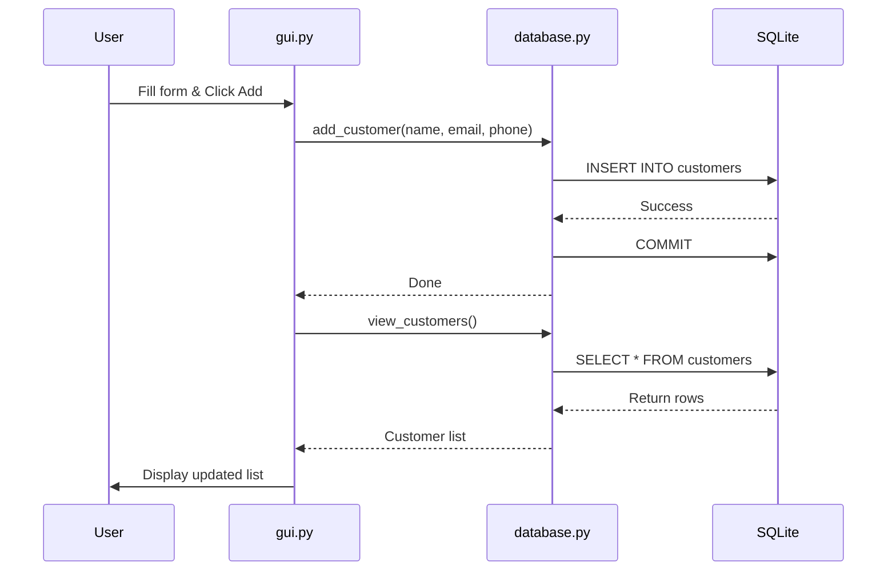
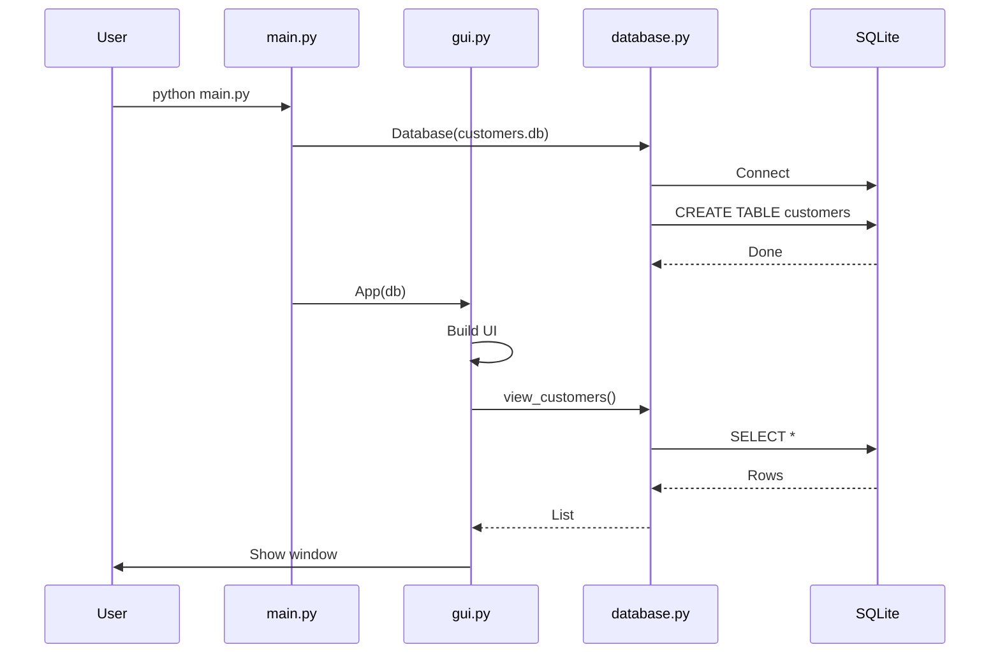
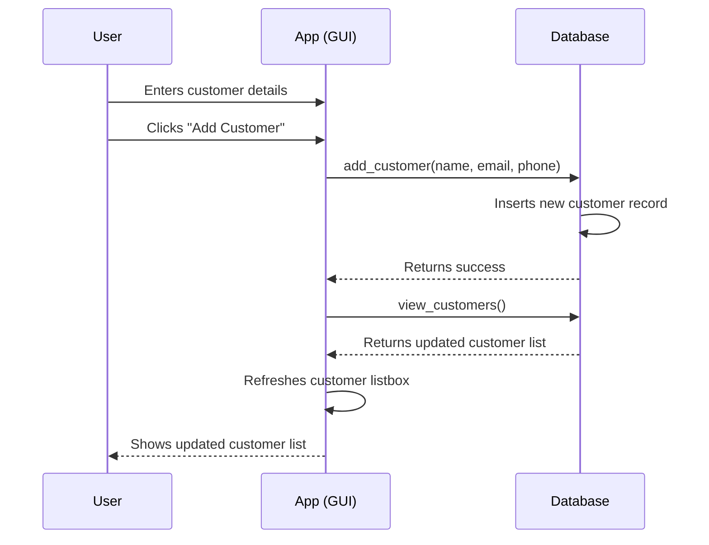

## Sequence Diagrams

## Diagram 1: Add Customer Flow

```mermaid
sequenceDiagram
    participant User
    participant GUI as gui.py
    participant DB as database.py
    participant SQLite as SQLite
    
    User->>GUI: Fill form & Click Add
    GUI->>DB: add_customer(name, email, phone)
    DB->>SQLite: INSERT INTO customers
    SQLite-->>DB: Success
    DB->>SQLite: COMMIT
    DB-->>GUI: Done
    GUI->>DB: view_customers()
    DB->>SQLite: SELECT * FROM customers
    SQLite-->>DB: Return rows
    DB-->>GUI: Customer list
    GUI->>User: Display updated list
```

## Diagram 2: Application Startup

```mermaid
sequenceDiagram
    participant User
    participant main as main.py
    participant GUI as gui.py
    participant DB as database.py
    participant SQLite as SQLite
    
    User->>main: python main.py
    main->>DB: Database(customers.db)
    DB->>SQLite: Connect
    DB->>SQLite: CREATE TABLE customers
    SQLite-->>DB: Done
    main->>GUI: App(db)
    GUI->>GUI: Build UI
    GUI->>DB: view_customers()
    DB->>SQLite: SELECT *
    SQLite-->>DB: Rows
    DB-->>GUI: List
    GUI->>User: Show window
```

This diagram shows the sequence of events when a user adds a new customer.

```mermaid
sequenceDiagram
    participant User
    participant App (GUI)
    participant Database

    User->>App (GUI): Enters customer details
    User->>App (GUI): Clicks "Add Customer"
    App (GUI)->>Database: add_customer(name, email, phone)
    Database->>Database: Inserts new customer record
    Database-->>App (GUI): Returns success
    App (GUI)->>Database: view_customers()
    Database-->>App (GUI): Returns updated customer list
    App (GUI)->>App (GUI): Refreshes customer listbox
    App (GUI)-->>User: Shows updated customer list
```