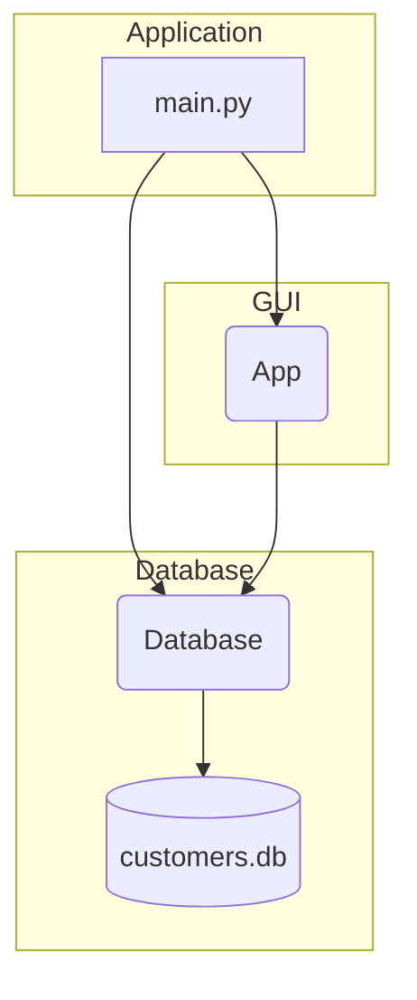

```mermaid
graph TD;
    subgraph Application
        A[main.py]
    end

    subgraph GUI
        B(App)
    end

    subgraph Database
        C(Database)
        D[(customers.db)]
    end

    A --> B;
    A --> C;
    B --> C;
    C --> D;
```