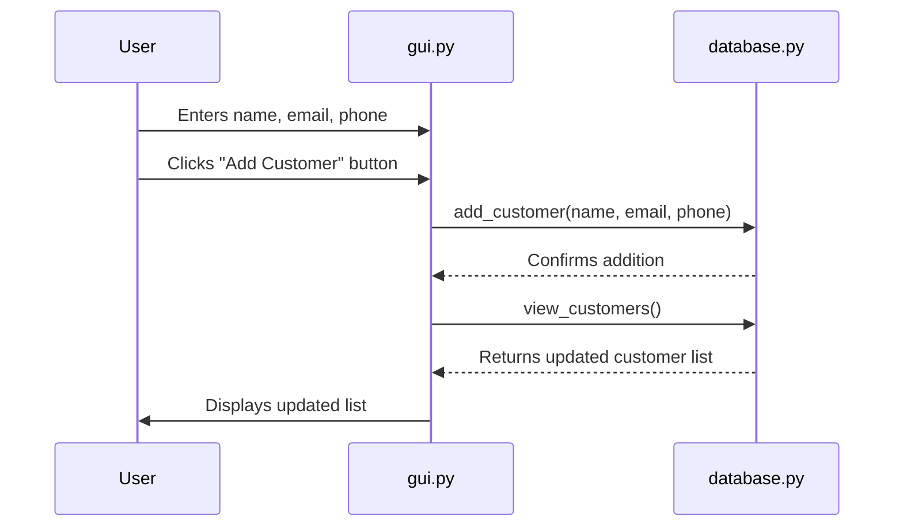

```mermaid
sequenceDiagram;
    participant User
    participant App as gui.py
    participant Database as database.py

    User->>App: Enters name, email, phone
    User->>App: Clicks "Add Customer" button
    App->>Database: add_customer(name, email, phone)
    Database-->>App: Confirms addition
    App->>Database: view_customers()
    Database-->>App: Returns updated customer list
    App->>User: Displays updated list
```