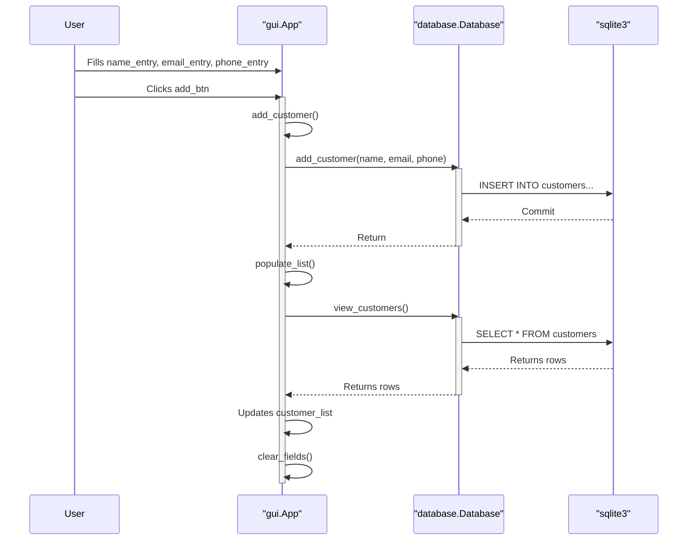

```mermaid
sequenceDiagram;
    participant User
    participant App as "gui.App"
    participant Database as "database.Database"
    participant SQLite as "sqlite3"

    User->>App: Fills name_entry, email_entry, phone_entry
    User->>App: Clicks add_btn
    activate App
    App->>App: add_customer()
    App->>Database: add_customer(name, email, phone)
    activate Database
    Database->>SQLite: INSERT INTO customers...
    SQLite-->>Database: Commit
    Database-->>App: Return
    deactivate Database
    App->>App: populate_list()
    App->>Database: view_customers()
    activate Database
    Database->>SQLite: SELECT * FROM customers
    SQLite-->>Database: Returns rows
    Database-->>App: Returns rows
    deactivate Database
    App->>App: Updates customer_list
    App->>App: clear_fields()
    deactivate App
```