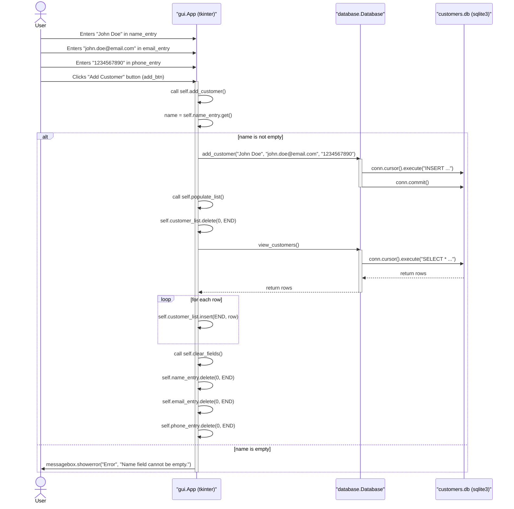

```mermaid
sequenceDiagram;
    actor User
    participant App as "gui.App (tkinter)"
    participant Database as "database.Database"
    participant DB as "customers.db (sqlite3)"

    User->>App: Enters "John Doe" in name_entry
    User->>App: Enters "john.doe@email.com" in email_entry
    User->>App: Enters "1234567890" in phone_entry
    User->>App: Clicks "Add Customer" button (add_btn)

    activate App
    App->>App: call self.add_customer()
    App->>App: name = self.name_entry.get()
    alt name is not empty
        App->>Database: add_customer("John Doe", "john.doe@email.com", "1234567890")
        activate Database
        Database->>DB: conn.cursor().execute("INSERT ...")
        Database->>DB: conn.commit()
        deactivate Database

        App->>App: call self.populate_list()
        App->>App: self.customer_list.delete(0, END)
        App->>Database: view_customers()
        activate Database
        Database->>DB: conn.cursor().execute("SELECT * ...")
        DB-->>Database: return rows
        Database-->>App: return rows
        deactivate Database

        loop for each row
            App->>App: self.customer_list.insert(END, row)
        end

        App->>App: call self.clear_fields()
        App->>App: self.name_entry.delete(0, END)
        App->>App: self.email_entry.delete(0, END)
        App->>App: self.phone_entry.delete(0, END)
    else name is empty
        App->>User: messagebox.showerror("Error", "Name field cannot be empty.")
    end
    deactivate App
```
