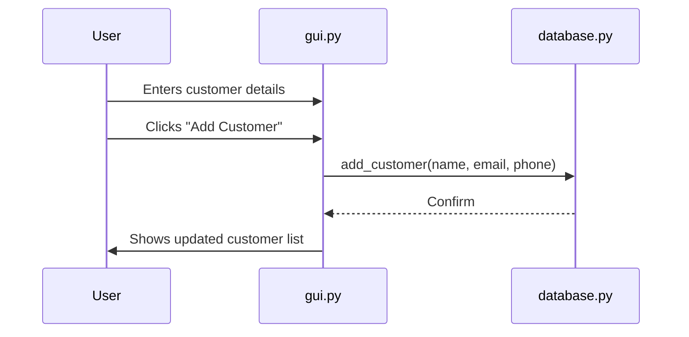

```mermaid
sequenceDiagram;
    participant User
    participant App as gui.py
    participant Database as database.py

    User->>App: Enters customer details
    User->>App: Clicks "Add Customer"
    App->>Database: add_customer(name, email, phone)
    Database-->>App: Confirm
    App->>User: Shows updated customer list
```