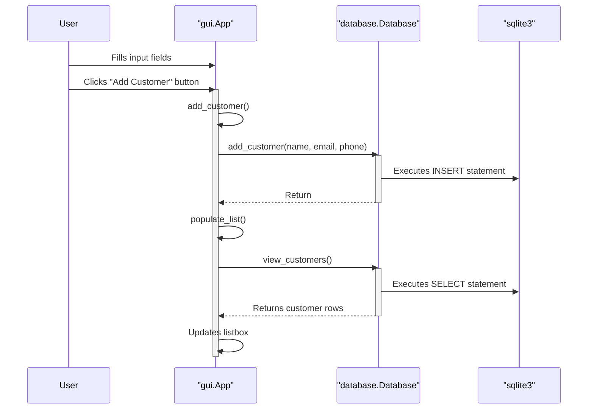

```mermaid
sequenceDiagram;
    participant User
    participant App as "gui.App"
    participant Database as "database.Database"
    participant SQLite as "sqlite3"

    User->>App: Fills input fields
    User->>App: Clicks "Add Customer" button
    activate App
    App->>App: add_customer()
    App->>Database: add_customer(name, email, phone)
    activate Database
    Database->>SQLite: Executes INSERT statement
    Database-->>App: Return
    deactivate Database
    App->>App: populate_list()
    App->>Database: view_customers()
    activate Database
    Database->>SQLite: Executes SELECT statement
    Database-->>App: Returns customer rows
    deactivate Database
    App->>App: Updates listbox
    deactivate App
```